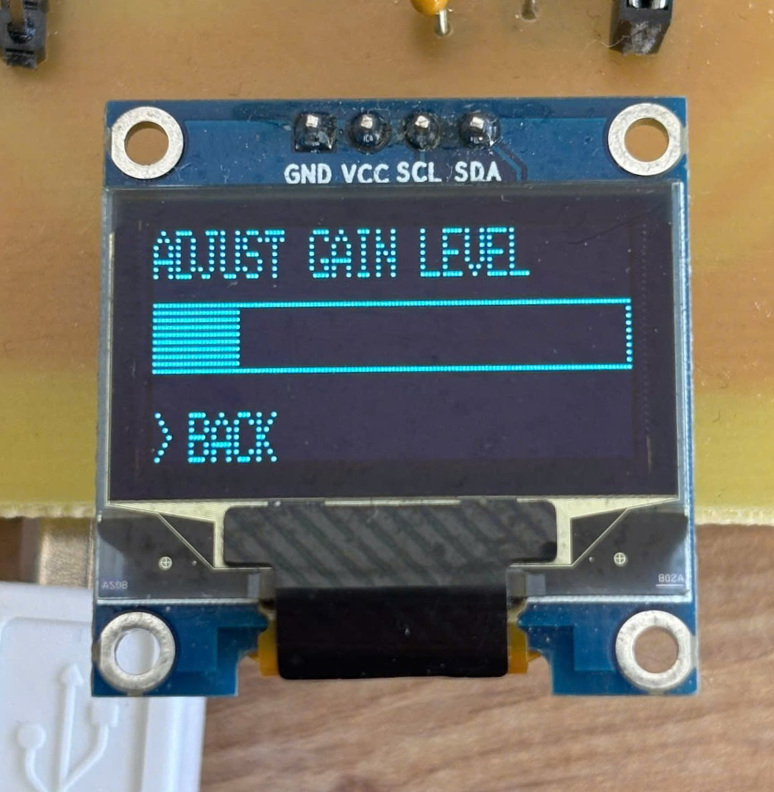
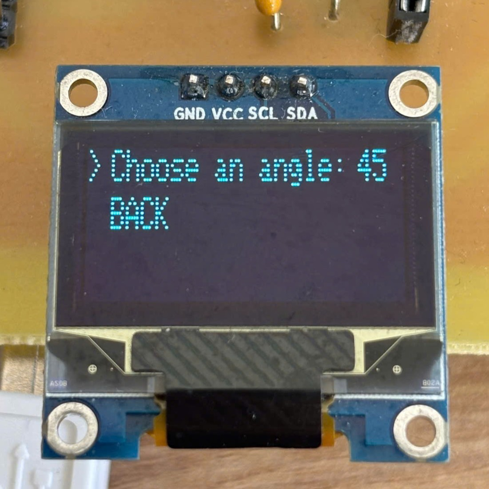
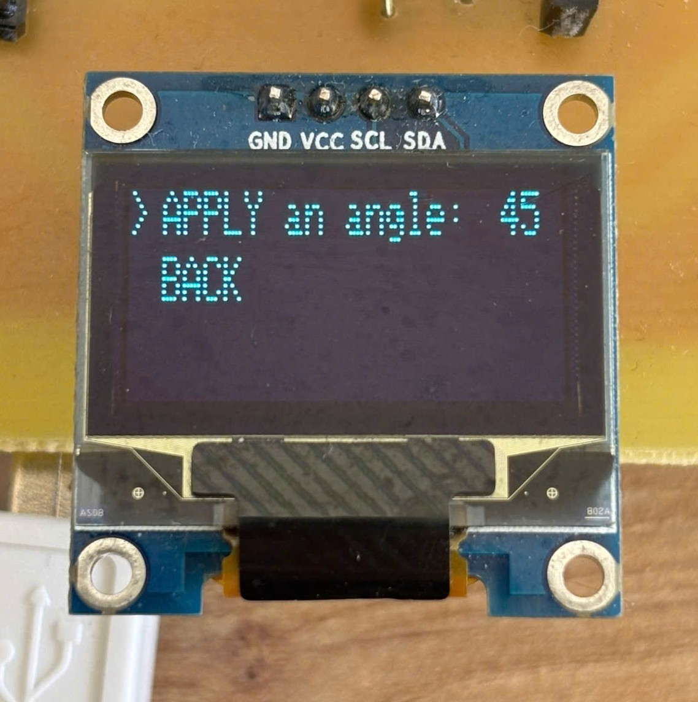
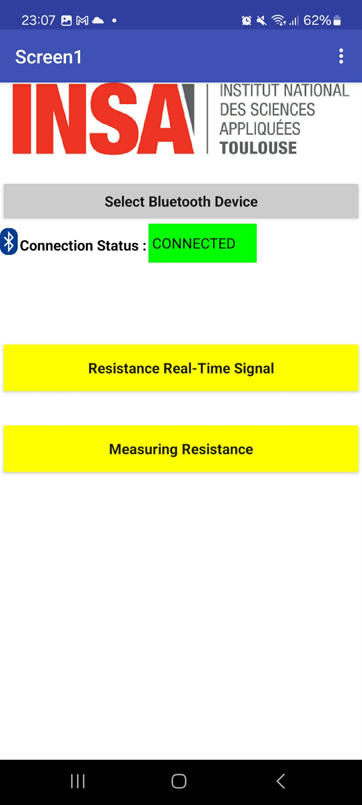
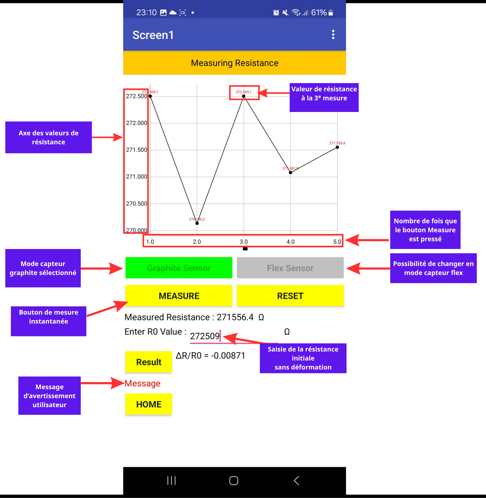
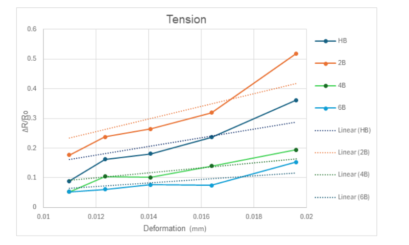
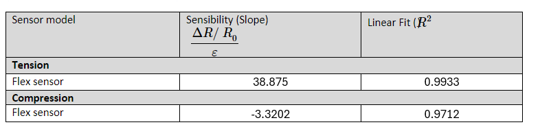
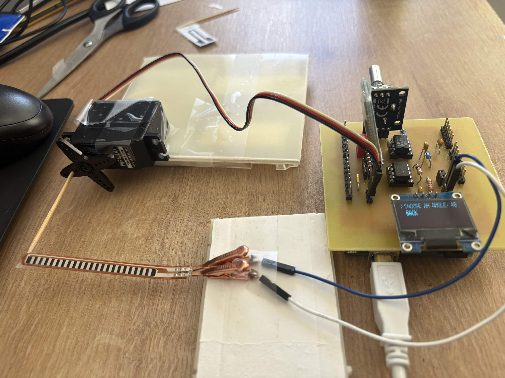
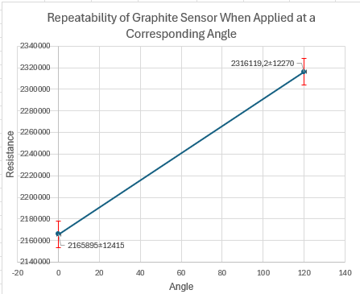
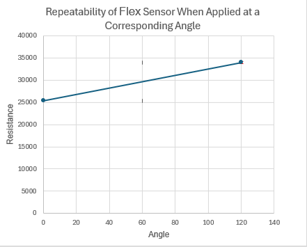

# Projet Capteur Graphite
## Context
Ce projet a été réalisé dans le cadre du cours « Du capteur au banc de test », durant le deuxième semestre de l’année universitaire 2025–2026, au sein de la formation de 4ᵉ année en Génie Physique. Il s’appuie sur l’article scientifique « Pencil Drawn Strain Gauges and Chemiresistors on Paper » de Cheng-Wei Lin, Zhibo Zhao, Jaemyung Kim et Jiaxing Huang, qui étudie les propriétés du graphite et démontre son potentiel en tant que matériau sensible pouvant être utilisé comme capteur de déformation.

L’idée principale de ce projet est de concevoir un capteur de déformation low-tech, inspiré de cette publication, en utilisant uniquement une feuille de papier et une couche de graphite d'un crayon déposée par simple tracé.

L’objectif est d’évaluer les performances, la fiabilité de ce capteur à faible coût et de vérifier s’il peut être commercialisé.
## Sommaire
- [Context](#context)
- [Sommaire](#sommaire)
- [Réalisation du projet](#réalisation-du-projet)
  - [Matériaux nécessaire](#matériaux-nécessaire)
  - [Simulation électronique sur LTSpice](#simulation-électronique-sur-ltspice)
  - [Conception PCB avec Kidcad](#conception-pcb-avec-kidcad)
  - [Réalisation du Shield](#réalisation-du-shield)
  - [Code Arduino](#code-arduino)
  - [Conception application sur MIT App Inventor](#conception-application-sur-mit-app-inventor)
  - [Bancs de test](#bancs-de-test)
    - [Sensibilité](#sensibilité)
    - [Répétabilité](#répétabilité)
- [Datasheet](#datasheet)
- [Conclusion](#conclusion)

## Réalisation du projet
Afin d’atteindre les objectifs fixés, le travail a été divisé en deux tâches principales : 

1. la mesure de la résistance du capteur en graphite et son affichage via une interface

2. la réalisation de bancs de test pour évaluer l’efficacité de ce capteur
### Matériaux nécessaire
Pour réaliser le shield, nous avons besoin du matériel suivant :

* 1 carte Arduino UNO Rev 3
* 1 module Bluetooth (HC-05)
* 1 encodeur rotatif (KY-040)
* 1 écran OLED (Joy-it SBC-OLED01)
* 1 capteur de flexion commercial (Spectra Symbol Flex Sensors 005 21)
* 1 capteur en graphite fabriqués de la mine d'un crayon de papier
* 1 amplificateur (LTC1050)
* 1 potentiomètre numérique (MCP41010)
* 1 résistance 1kΩ, 1 résistance 10kΩ, 2 résistances 100kΩ et 1 résistance 27kΩ
* 3 condensateurs 100nF, 1 condensateur 1µF
* 2 supports IC pour le potentiomètre et l'amplificateur
* Pin headers (male et female)

Pour les bancs de test :
* 1 modèle 3D à diamètres variables
* 1 servomoteur (Parallax standard servo)

### Simulation électronique sur LTSpice
Dans le cas réel, la résistance du capteur en graphite est très élevée, ce qui conduit à un courant très faible, de l’ordre de 100 à 150 nA. Dans ces conditions, une mesure directe de la résistance à l’aide d’un multimètre n’est pas optimale.
Nous avons donc choisi de mesurer ce faible courant à l’aide d’un microcontrôleur. L’Arduino Uno a été retenu car il est open source, simple à utiliser, et bénéficie d’une large communauté, ce qui nous rend plus facile pour une première approche des microcontrôleurs.

En raison du courant très faible fourni par le capteur, nous avons utilisé un amplificateur transimpédance pour transformer ce courant en une tension mesurable par l’Arduino. Le gain du circuit peut être modifié simplement en changeant la valeur de la résistance R2.

Pour limiter le bruit, en particulier le bruit du réseau électrique à 50 Hz, trois filtres passe‑bas ont été ajoutés. Ces filtres permettent aussi de s’assurer que le signal en sortie du circuit est compatible avec la fréquence d’acquisition de l’Arduino.

Pour la simulation, le capteur graphite réel est modélisé dans LTSpice par une sortie de courant d’environ 150 nA. Le sous‑ensemble C3, R5 et le générateur V2 permet de simuler les bruits provenant de l’environnement.

  
   
  <b>Figure 1: Menu principal</b>

<table>
  <tr>
    <td align="center">
      
       
      <b>Figure </b>
    </td>
    <td align="center">
      
       
     <b>Figure </b>
    </td>
  </tr>
</table>

<table>
  <tr>
    <td align="center">
      
       
      <b>Figure </b>
    </td>
    <td align="center">
      
       
     <b>Figure </b>
    </td>
  </tr>
</table>

Les simulations montrent une tension d’entrée du circuit d’environ 18 mV avant filtrage et amplification. En sortie, le signal est correctement amplifié et filtré, comme illustré sur la figure correspondante. Le niveau d’amplification obtenu dépend directement de la valeur choisie pour R2.

### Conception PCB avec Kidcad

  
   
  <b>Figure 1: Menu principal</b>

<table>
  <tr>
    <td align="center">
      
       
      <b>Figure </b>
    </td>
    <td align="center">
      
       
     <b>Figure </b>
    </td>
  </tr>
</table>

### Réalisation du Shield
<table>
  <tr>
    <td align="center">
      
       
      <b>Figure </b>
    </td>
    <td align="center">
      
       
     <b>Figure </b>
    </td>
  </tr>
</table>

### Code Arduino
Nous avons développé un programme sous Arduino IDE.  Dans le code, nous avons ajouté les librairies Adafruit_SSD1306 pour piloter l'écran OLED et SoftwareSerial pour le Bluetooth HC-05. Pour rendre le code plus clair et mieux organisé, le programme Arduino est divisé en plusieurs fichiers :

* Le fichier "menu_OLED" est utilisé pour contrôler le potentiomètre numérique donc régler le gain.
* Le fichier "digipot" gère l’affichage sur l’écran OLED et la lecture de l’encodeur rotatif.
* Le fichier principal (main) "capteur_projet" s’occupe du module Bluetooth, du servomoteur, et contient les fonctions setup et loop.

Ce programme permet : 
* de sélectionner le niveau d’amplification du signal
* de contrôler un servomoteur
* de communiquer avec une application Android grâce à un module Bluetooth intégré au shield, permettant ainsi l’échange de données entre le capteur et l’interface mobile

Ces deux premières fonctionnalités sont pilotées via un écran OLED pour l’affichage et un encodeur rotatif utilisé pour la navigation et la sélection dans les menus.

  
   
  <b>Figure 1: Menu principal</b>

  
   
  <b>Figure 1: Gain menu</b>
   
  Il suffit d’appuyer sur l’encodeur pour revenir au menu principal

<table>
  <tr>
    <td align="center">
      
       
      <b>Figure </b>
    </td>
    <td align="center">
      
       
     <b>Figure </b>
    </td>
    <td align="center">
      
       
      <b>Figure </b>
    </td>
  </tr>
</table>

Lorsque l’utilisateur entre dans le menu du servomoteur, l’écran de la figure 1 s’affiche.
En appuyant sur l’encodeur, il est possible de sélectionner un angle : le texte « Choose an angle » passe en majuscules (figure 2).
Un nouvel appui sur l’encodeur permet d’appliquer l’angle sélectionné au servomoteur, et le mot « APPLY » apparaît en majuscules (figure 3).
La sortie du menu servomoteur s’effectue en cliquant deux fois de suite sur l’encodeur rotatif.

Concernant la fonctionnalité du code pour communiquer avec l'application Android, en fonction des commandes reçues depuis l’application via module Bluetooth, le programme Arduino peut renvoyer à l’application :
* soit en continu (chaque 100 miliseconds) la valeur de la résistance du capteur en graphite ainsi que la tension en sortie du circuit d’amplification (tension ADC) 
* soit de manière ponctuelle la résistance du capteur en graphite
* ou de manière ponctuelle la résistance du flex sensor

Pour obtenir la valeur de la résistance du capteur, le code Arduino commence par convertir la lecture analogique (comprise entre 0 et 1023) en une tension comprise entre 0 et 5 V.
La résistance du capteur en graphite et du capteur flex est ensuite calculée à partir de cette tension en utilisant la formule suivante :

* $R_{\text{graphite}} = \left(1 + \frac{R_3}{R_2}\right) \cdot R_1 \cdot \left(\frac{V_{\text{CC}}}{V_{\text{ADCgraphite}}}\right) - R_1 - R_5$

* $R_{\text{flex}} = R_{\text{Division}} \cdot \frac{V_{\text{flex}}}{V_{\text{CC}} - V_{\text{ADCflex}}}$
### Conception application sur MIT App Inventor
Pour assurer la communication avec l’utilisateur et l’affichage des données, une application Android a été développée à l’aide de MIT App Inventor.

Cette application communique avec l’Arduino via une connexion Bluetooth et intègre deux fonctionnalités principales :

* Affichage en temps réel de la variation de la résistance du capteur graphite lorsqu’une déformation est appliquée. La tension ADC est également affichée afin de permettre à l’utilisateur d’ajuster le gain lorsque le signal est saturé ou trop faible. (Figure)
* Mesure ponctuelle de la résistance du capteur sélectionné lors de l’appui sur le bouton Measure. L’utilisateur peut saisir la valeur de référence du capteur à l’état non déformé, puis l’application calcule automatiquement le rapport ΔR/R0. (Figure)

  
   
  <b>Figure 1: Menu principal</b>

<video src="Images/download.mp4" controls width="600">
    Votre navigateur ne prend pas en charge la vidéo.  
</video>
  <b>Figure 1: Menu principal</b>

  
   
  <b>Figure 1: Menu principal</b>

### Bancs de test
Afin d’étudier les caractéristiques et d’évaluer les performances du capteur en graphite, deux bancs de test ont été mis en place.
Ces bancs permettent d’analyser en particulier la sensibilité et la rentabilité du capteur, en comparaison avec un capteur flex commercial.
#### Sensibilité
Pour mesurer la sensibilité des capteurs, un modèle mécanique imprimé en 3D a été utilisé.

  
   
  <b>Figure 1: Menu principal</b>

 

Ce modèle est constitué de plusieurs arcs de cercle de rayons différents, chaque rayon correspondant à un niveau de déformation différent appliqué au capteur.

Le capteur est successivement placé sur chaque arc, ce qui permet d’imposer une déformation contrôlée, aussi bien en traction (tension) qu’en compression.
La même procédure est appliquée au capteur graphite et au capteur flex, afin de permettre une comparaison directe.
Pour le capteur graphite, les mesures ont été réalisées avec différents types de graphite : HB, 2B, 4B et 6B.
Les résultats obtenus sont présentés sur les figures suivantes, montrant l’évolution du rapport ΔR/R0 en fonction de la déformation, en traction et en compression.

  
   
  <b>Figure 1: Menu principal</b>

  
   
  <b>Figure 1: Menu principal</b>

 

##### Résultat

  
   
  <b>Figure 1: Menu principal</b>
   
  
  <b>Figure 1: Menu principal</b>

   

Les mesures montrent une relation globalement linéaire entre la variation de résistance ΔR/R0\Delta R / R_0ΔR/R0​ et la déformation appliquée, aussi bien en traction qu’en compression. Cela indique que les capteurs réagissent de manière cohérente aux déformations imposées.

Pour le capteur graphite, le graphite de type 2B présente la sensibilité la plus élevée, aussi bien en traction qu’en compression, comparé aux graphites HB, 4B et 6B. En comparaison avec le capteur flex :

* en traction, la sensibilité du capteur flex est supérieure à celle du graphite 2B ;
* en compression, la sensibilité du capteur flex est très faible, ce qui est cohérent avec le fait que ce type de capteur est principalement conçu pour fonctionner en traction, comme spécifié par le fabricant.
#### Répétabilité
Pour vérifier la répétabilité du capteur, un banc de test simple a été mis en place.
Comme montré sur les figures, un servomoteur est relié au capteur à l’aide d’un petit bâton en bois. L’ensemble du montage est fixé avec de la colle afin de limiter les déplacements parasites pendant les mesures.
Le servomoteur applique successivement un angle de 0° puis de 120° au capteur. Ce cycle est répété cinq fois de suite.
Ce test est réalisé avec un capteur graphite 2B, car ce type de graphite a montré la meilleure sensibilité lors des essais précédents. Le même protocole est également appliqué au capteur flex afin de pouvoir comparer les résultats.

  
   
  <b>Figure 1: Menu principal</b>

 

##### Résultat
<table>
  <tr>
    <td align="center">
      
       
      <b>Figure </b>
    </td>
    <td align="center">
      
       
     <b>Figure </b>
    </td>
  </tr>
</table>

<table>
  <tr>
    <td align="center">
      
       
      <b>Figure </b>
    </td>
    <td align="center">
      
       
     <b>Figure </b>
    </td>
  </tr>
</table>

Les figures 1 et 2 montrent la valeur de la résistance mesurée pour chaque angle, avec une courbe correspondant à chaque répétition du test.
Les figures 3 et 4 présentent la valeur moyenne de la résistance pour chaque angle. Les barres d’erreur représentent l’écart‑type calculé à partir des différentes mesures.
Pour le capteur flex, la répétabilité est très bonne : les courbes sont presque superposées et l’écart‑type est très faible, au point d’être difficilement visible sur le graphique.
Pour le capteur graphite 2B, on observe un léger décalage entre les différentes répétitions. La répétabilité est donc un peu moins bonne que celle du capteur flex. Toutefois, l’écart entre les mesures reste faible, de l’ordre de 0,5 % de la valeur moyenne

### Datasheet
### Conclusion
### Remarque/Difficulte
### Contact